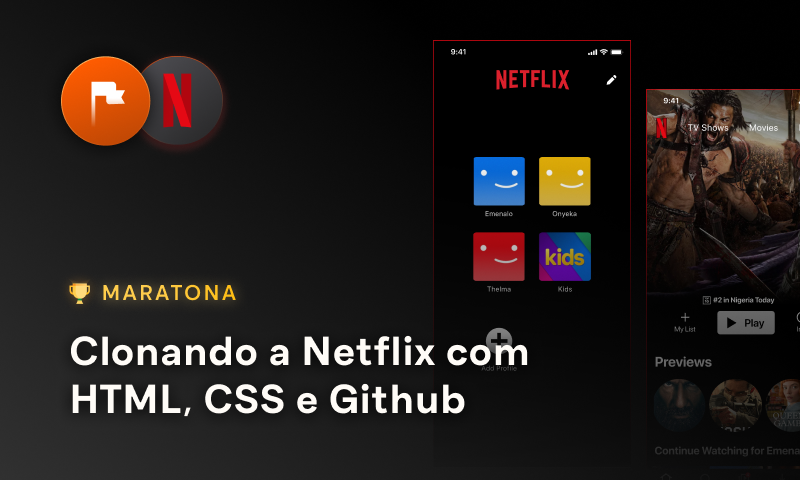

  

Este é o repositório principal para a maratona [🏁 "Clonando  a Netflix com HTML, CSS e GitHub"](https://www.maratonas.academy/maratona-netflix) da [Maratonas Academy](https://www.maratonas.academy/). Esta maratona trata de um treinamento intensivo de 14 dias, de HTML, CSS e Git/GitHub baseado no desenvolvimento de projetos e resolução de desafios diários. Além das atividades propostas pela maratona, preparei registros diários (*daily logs*) para sintetizar todos os aprendizados ao longo da maratona. 

- [Dia 01](daily-log/day01.md)
- [Dia 02](daily-log/day02.md)